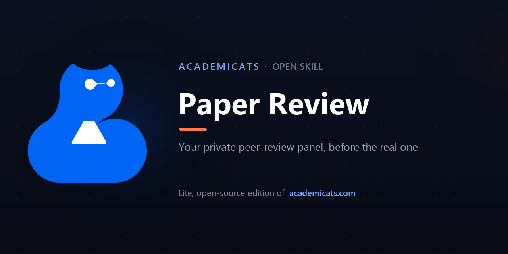

<div align="center">

**English** · [中文](README.zh-CN.md)



<br>

# 🐱 Paper Review

**Run your own draft through a six-phase simulated peer-review panel and get back a referee letter plus a scored verdict — calibrated to how finished your draft really is.**

<br>

[](LICENSE)
&nbsp;[](https://claude.com/claude-code)
&nbsp;[](https://academicats.com)

</div>

---

> ### 🪶 This is the **lite, open-source edition** of [**AcademiCats**](https://academicats.com) — now in free open beta
> The full product at **[academicats.com](https://academicats.com)** is an AI research workbench that takes you from *finding* papers through *reading, writing, and self-review*. This skill is a free, self-contained slice of the review workflow you can run on your own Claude.

---

## ✨ What it does

🧪 **A whole panel's scrutiny, from one model** — your draft is examined through five independent review lenses (significance, rigor, evidence, argument, clarity) that then **challenge each other** in a rebuttal round before a moderator reconciles them. That cross-examination is what kills plausible-but-wrong feedback and sharpens what's real.

🔬 **Judged by the right standard** — the methodology critique adapts to what you actually wrote: an observational study is checked against **STROBE**, a systematic review against **PRISMA + AMSTAR-2**, a trial against **CONSORT**, a qualitative study against **COREQ**, a proposal against **NIH** criteria, an essay against the **Toulmin** model of argument — not one generic checklist for everything.

📊 **A verdict with a number** — you get a referee letter (verdict, strengths, issues to fix, optional improvements) *and* a scorecard: each dimension scored 0–10, an overall, and a recommendation — **Accept / Minor / Major Revision / Reject**.

🎚️ **Calibrated to your stage** — tell it whether it's a *final*, *working*, *sketch*, or *student* draft, and it won't judge a class essay like a journal submission.

<br>

## 🎬 Demo

> *"Peer-review my draft — it's a working draft of a short research proposal. Is it ready?"*

You said it's a working draft — so it reviews straight away (no forms; it notes the stage it used so you can correct it). The result is **always the same shape** — a referee letter, a scorecard, then a one-line summary — no matter which model runs the skill:

> # Verdict
> A clear, relevant proposal — but as a working draft it's a promising skeleton, not yet a viable plan. The key fix: it rests on *lines of code per hour*, a discredited productivity proxy that would invalidate the result no matter how the experiment runs.
>
> # Strengths
> - The two-group design is the right shape for the question.
> - Clear, readable prose.
>
> # Issues to Fix
> **Replace the sole metric** — lines-of-code rewards verbosity and ignores correctness; add a validated outcome (task completion, tests passed, time-on-task).
> **Ground it in prior work** — there are no citations anywhere; add a short related-work paragraph.

| Significance | Rigor | Evidence | Argument | Clarity | Overall | Verdict |
|:--:|:--:|:--:|:--:|:--:|:--:|:--:|
| 6 | 3 | 3 | 6 | 6 | **4.8/10** | **Major Revision** |

> *A relevant question undermined by a confirmation-seeking design; not ready until the metric and controls are fixed.*
> *Appraised as a research proposal against NIH criteria (Significance · Innovation · Approach) · 5 lenses cross-checked.*

<br>

## 🚀 Get started — pick your platform

Pick whichever AI you use; each setup takes under a minute.

**🖥️ Claude Code** — runs locally, triggers itself
```bash
mkdir -p ~/.claude/skills
git clone https://github.com/jy1529098645-gif/Cat_paper_review.git ~/.claude/skills/paper-review
```
Restart Claude Code, then just ask — *"review my draft, it's a working draft of a research proposal …"*

**🌐 Claude (web / desktop app)** — download **[`paper-review.skill`](paper-review.skill)**, then upload it under **Settings → Capabilities → Skills**. Ask in any chat.

**🤖 ChatGPT** — open **[`PORTABLE_PROMPT.md`](PORTABLE_PROMPT.md)** and paste it into a **Custom GPT**'s *Instructions* (or just send it as your first message). Then paste your draft.

**💬 DeepSeek / any other model** — paste **[`PORTABLE_PROMPT.md`](PORTABLE_PROMPT.md)** as the **system prompt** (or first message). Then paste your draft.

> ✅ **No web access needed** — Paper Review is pure reasoning, so it runs fully on any model, online or off. It reviews the draft you paste; it never needs to look anything up.

<br>

## 💙 What's inside

Six phases — **intake → 5 lenses → rebuttal round → moderator → editor letter → scorecard** — distilled from the same review method behind the full product.

|  | Paper Review (this skill) | [AcademiCats full product →](https://academicats.com) |
|---|:---:|:---:|
| ⚡ **Speed** | minutes (one Claude pass) | faster — streamed, parallel panel |
| Six-phase panel + scored verdict | ✅ | ✅ |
| Standards by paper type (STROBE / PRISMA / CONSORT / COREQ / Toulmin) | ✅ | ✅ |
| Stage-aware calibration | ✅ | ✅ |
| Find & read the literature it asks for | bring your own | ✅ end-to-end |
| Saved drafts & revision history | — | ✅ |
| Polished web & mobile app | — | ✅ |

## 🐱 The AcademiCats skill family

Three open skills that chain into one research workflow — install any or all:

- 🔍 [Paper Search](https://github.com/jy1529098645-gif/Cat_paper_search) — find & read papers
- ✍️ [Synthesis Lab](https://github.com/jy1529098645-gif/Cat_synthesis_lab) — write grounded papers from your sources
- 🧪 **Paper Review** *(you are here)* — peer-review your own draft

**Install all three at once** — clone any one repo, then run `bash install.sh`.

## 🙋 FAQ

- **What are all these files?** Use just one path above — a git clone (Claude Code), the `.skill` file (Claude web/desktop), or `PORTABLE_PROMPT.md` (ChatGPT/DeepSeek). `SKILL.md` and `references/` are internals your assistant loads for you — no need to open them.
- **It didn't trigger?** Restart Claude Code after installing, and phrase your message as a task — *"review my draft …"*.
- **Tell it the draft stage.** Say it's a *"working draft"*, *"final"*, *"rough sketch"*, or *"student essay"* so it grades you fairly — a class essay shouldn't be judged like a journal submission.
- **Which model?** Any strong model works — Claude Sonnet/Opus, GPT‑4o/o‑series, or DeepSeek‑V3/R1 give the best results.
- **Private & free?** It runs on your own AI — no account, nothing sent to us.

<div align="center">
<br>

### Want the whole research workflow?
**→ [academicats.com](https://academicats.com) ←**

*🚀 The full product is in **open beta** — free to try right now.*

<br>

Made with 💙 by the [AcademiCats](https://academicats.com) team · [MIT License](LICENSE)

</div>
