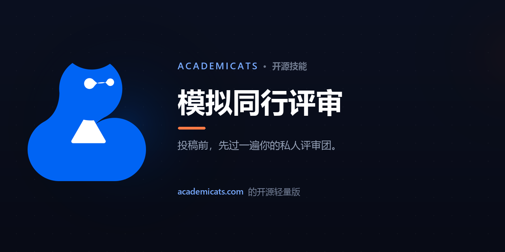

<div align="center">

[English](README.md) · **中文**



<br>

# 🐱 模拟同行评审

**让你自己的草稿走完六阶段模拟同行评审，得到一封评审意见信 + 一份评分裁决 —— 并按你的稿件实际完成度精准校准。**

<br>

[](LICENSE)
&nbsp;[](https://claude.com/claude-code)
&nbsp;[](https://academicats.com)

</div>

---

> ### 🪶 这是 [**AcademiCats**](https://academicats.com) 的**开源轻量版**
> 完整产品在 **[academicats.com](https://academicats.com)** —— 一个 AI 研究工作台，带你从*找文献*一路走到*读、写、自审*。本 skill 是其中评审工作流的一块免费、自包含、可在你自己的 Claude 上运行的切片。

---

## ✨ 它能做什么

🧪 **一整个评审团，而非一家之言** —— 五位专家评审（结构、论证、证据、语言、原创性）各从自己的视角批评，再在**反驳轮**里互相辩论，最后由仲裁者统合。正是这种交叉质询，淘汰掉"看似有理实则错误"的意见，并把真正的问题打磨锋利。

📊 **带数字的裁决** —— 你会拿到一封评审信（裁决、优点、待修问题、可选改进）*以及*一份评分卡：每个维度 0–10 分、一个总分、一条建议 —— **接受 / 小修 / 大修 / 拒稿**。

🎚️ **按阶段校准** —— 告诉它这是*终稿、在写稿、草图*还是*学生作业*，它就不会拿期刊投稿的标准去苛求一篇课程论文。

<br>

## 🎬 演示

> *"帮我审一下这份草稿 —— 是一份在写的短研究计划。能投了吗？"*

它会先弹一个**评审设置**让你选——主动权在你手上，换任何大模型都一样：

> 🧪 **评审设置** —— 确认或修改，然后我就评：
> 1. **稿件阶段** —— 在写稿  *(终稿 / 在写稿 / 草图 / 学生作业)*
> 2. **重点** —— 五个维度全看  *(结构 / 论证 / 证据 / 语言 / 原创性 —— 或"全部")*
> 3. **语言** —— 英文
>
> 回复任何修改，或直接说 **go**。

确认后，它返回的成品**永远是同一种结构**——评审信、评分卡、一句话总结——换任何大模型跑都一样：

> # 裁决
> 这是一份针对真实且有价值问题的短计划——背景音乐是否影响编程效率——有正确的两组对照设计直觉、文笔清晰。但作为在写稿，它还只是个有潜力的骨架而非可行方案；最关键的一处是结果度量：研究依赖*每小时代码行数*，这是一个已被学界否定的生产力替代指标，无论实验怎么跑都会让结论失效。
>
> # 优点
> - 两组对照设计的方向是对的。
> - 文笔清晰易读。
>
> # 待修问题
> **替换唯一的指标** —— "每小时写多少行代码"奖励冗长、忽视正确性；改用有效指标（任务完成度、测试通过数、用时）。
> **补上既有研究** —— 全文无任何引用；加一段相关工作。

| 结构 | 论证 | 证据 | 语言 | 原创性 | 总分 | 裁决 |
|:--:|:--:|:--:|:--:|:--:|:--:|:--:|
| 6 | 4 | 3 | 6 | 5 | **4.8/10** | **大修** |

> *一个有价值的问题，却被"只想证实"的设计拖累；在修好指标与对照之前还不能投。*

<br>

## 🚀 60 秒上手

```bash
# 安装到 Claude Code 的 skills 目录 —— 无依赖、零配置
mkdir -p ~/.claude/skills
git clone https://github.com/jy1529098645-gif/Cat_paper_review.git ~/.claude/skills/paper-review
```

重启 Claude Code，然后直接跟它说 —— *"帮我审这份草稿，是一份在写的研究计划…"* 或 *"把这篇文章当最终稿来同行评审 —— 能投了吗？"* skill 会**自动触发**，全程跑在你自己的 Claude 上。

**用网页版 / 桌面版 Claude？** 下载 **[`paper-review.skill`](paper-review.skill)**，在 **Settings → Capabilities → Skills** 里上传，然后在任意对话里直接问即可。

<br>

## 💙 内部构造

六个阶段 —— **接收 → 5 位专家 → 反驳轮 → 仲裁 → 主编信 → 评分卡** —— 提炼自驱动完整产品的同一套评审团。

|  | 模拟同行评审（本 skill） | [AcademiCats 完整产品 →](https://academicats.com) |
|---|:---:|:---:|
| 六阶段评审团 + 评分裁决 | ✅ | ✅ |
| 按稿件阶段校准 | ✅ | ✅ |
| 自动找并读它需要的文献 | 自备文献 | ✅ 端到端 |
| 草稿保存与修订历史 | — | ✅ |
| 精致的网页与移动端 | — | ✅ |

## 🐱 AcademiCats 技能家族

三个开源 skill，串起一条完整的研究工作流——按需安装其一或全部：

- 🔍 [论文检索](https://github.com/jy1529098645-gif/Cat_paper_search) —— 找文献、读文献
- ✍️ [文献写作台](https://github.com/jy1529098645-gif/Cat_synthesis_lab) —— 据你的文献写出有据成稿
- 🧪 **模拟同行评审** *（你在这里）* —— 对你自己的草稿做同行评审

**一次装齐三个** —— clone 任意一个仓库后运行 `bash install.sh`。

## 🙋 常见问题

- **没触发？** 安装后重启 Claude Code，并把话说成一个任务 —— *"帮我审这份草稿…"*。
- **记得说明稿件阶段。** 告诉它是*"在写稿"、"终稿"、"草图"*还是*"学生作业"*，它才会公平打分——课程作业不该用期刊投稿的标准来评。
- **用哪个模型？** 任何模型都能跑；用 Claude Sonnet 及以上效果最好。
- **隐私 & 免费？** 全程跑在你自己的 Claude 上——无需账号、不向我们回传任何东西。

<div align="center">
<br>

### 想要完整的研究工作流？
**→ [academicats.com](https://academicats.com) ←**

<br>

由 [AcademiCats](https://academicats.com) 团队用 💙 打造 · [MIT 许可证](LICENSE)

</div>
